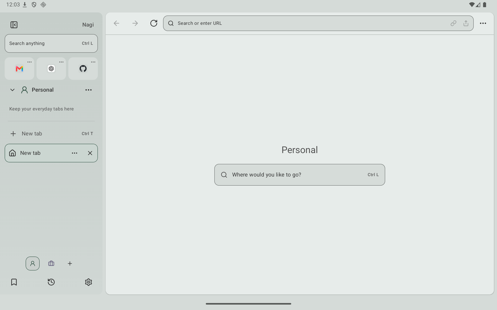
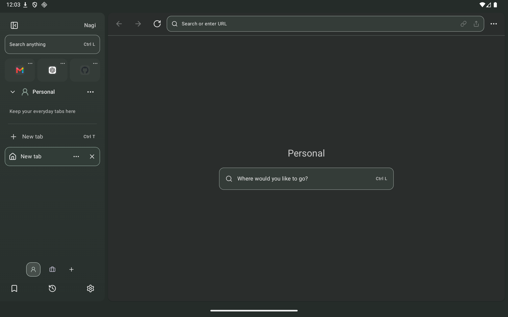
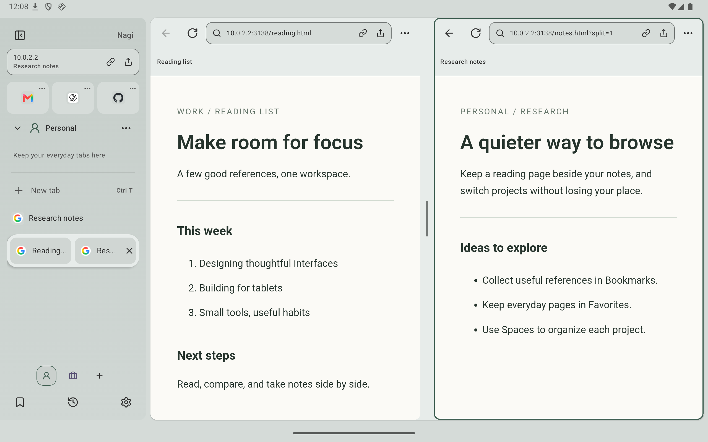
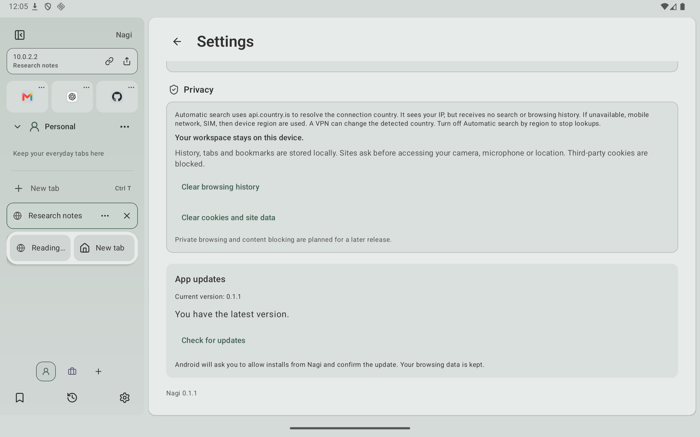

# Nagi

A sidebar-first workspace browser for Android tablets, built with Kotlin, Jetpack Compose, Material 3, WebView, Room, and DataStore.



[Download Nagi 0.3.0](https://takeruf.com/nagi) · [GitHub release](https://github.com/TakeruF/android-tab-browser/releases/tag/v0.3.0)

Install the APK over an existing GitHub/website installation to keep your workspace. Version 0.1.0 does not include an updater; install a newer APK manually, then use **Settings → App updates** for future releases. Google Play installations receive updates through Play. Local Debug builds, Play installations, and the former `com.orbit.browser` package have different signing or package identities; see [channel requirements](docs/RELEASING.md).

## Features

Version 0.3.0 adds advertisement/tracker blocking, private browsing on supported WebViews, Reader mode, video PiP/pop-out playback, trackpad history gestures, and responsive address actions. See [release notes](docs/play-store/release-notes-0.3.0.txt).

- Spaces with ordinary and pinned tabs, shared Favorites, Bookmarks, and history.
- A Command Bar for URLs, search, tabs, Spaces, and commands.
- Standard search and “Ask ChatGPT” actions, selected with arrow keys and Enter or by touch/click. Questions and requests for explanations or comparisons, and input of at least 80 characters, prioritize ChatGPT. Explicit URLs and engine keywords take precedence.
- Resizable Split panes with saved left/right tab pairs, a resizable/collapsible sidebar, and drag-and-drop organization for tabs and pairs.
- Light, dark, and system themes with adjustable theme colors and selection contrast.
- Japanese, Chinese, and Korean IME composition, keyboard shortcuts, and mouse/trackpad scrolling.
- Video picture-in-picture when returning Home, plus draggable/resizable in-browser pop-out videos across tabs and Spaces. Both are independently configurable under **Settings → Video**, enabled by default.
- Find in page, remembered desktop/mobile display choices per website, HTTP downloads, page-generated Blob/data downloads (up to 32 MB), and the system document picker.
- Camera photo uploads, native link/image drag, URL drop targets on pane address bars, and background-tab suspension with automatic restoration.
- Bookmark management, link/image context menus, site-data clearing, and verified in-app APK updates.
- Website password autofill through the selected Android system provider; see [password autofill](docs/PASSWORD_AUTOFILL.md).
- Advertisement/tracker blocking with site exceptions and pause/resume for a visit, isolated private browsing, and Reader mode with adjustable text size; see [privacy, blocking, and Reader](docs/PRIVACY_READER_BLOCKING.md).
- Supported external app links with an optional launch-blocking setting, disabled by default.

See the supported behavior and limitations below, including WebView requirements and device-validation coverage.

## Build and run

Open this directory in Android Studio, sync Gradle, and run `app` on an Android 8.0+ tablet. Landscape is recommended; rotation and Android multi-window remain available.

- JDK 17
- Android SDK Platform 36; Android Studio/Gradle resolves the build tools
- minSdk 26 / targetSdk 36
- Included Gradle Wrapper

```sh
git clone https://github.com/TakeruF/android-tab-browser.git
cd android-tab-browser
./gradlew :app:assembleGithubDebug --no-parallel
adb install -r app/build/outputs/apk/github/debug/app-github-debug.apk
adb shell am start -n com.takeruf.nagi/.MainActivity
```

Set `ANDROID_HOME` or add `sdk.dir` to the Git-ignored `local.properties`. Debug development needs no release keystore; Release signing is configured separately outside Git. With multiple devices, use `adb -s <serial>`.

The Debug APK is `app/build/outputs/apk/github/debug/app-github-debug.apk`. Generate the signed Release with `./gradlew :app:assembleGithubRelease`; see [distribution and in-app updates](docs/RELEASING.md) for signing and publication.

Build the Google Play upload bundle with `./gradlew :app:bundlePlayRelease` (output: `app/build/outputs/bundle/playRelease/app-play-release.aab`). The `github` flavor keeps verified APK updates; the `play` flavor contains no GitHub update transport or APK installer and directs users to Google Play. Both use `com.takeruf.nagi`; see signing/channel-switch requirements in [RELEASING.md](docs/RELEASING.md).

Privacy policy: [takeruf.com/nagi/privacy](https://takeruf.com/nagi/privacy), also available from Settings in all four interface languages.

## Using Nagi

- Switch Spaces with the icons at the bottom of the sidebar. Edit a Space's name, color, and icon from its menu.
- Press `Ctrl L` to search URLs, queries, tabs, Spaces, and commands. Prefix input with `>` to show commands only.
- Suggestions and keyword searches use the selected common search engines. Initial choices are Google + ChatGPT, or Baidu + Qwen in mainland China. Your chosen combination persists across region changes. Add, edit, or delete engines in the customization screen.
- Hold a tab row to drag it; mouse and favicon dragging start directly. Insertion lines and a preview show the destination, with edge auto-scrolling.
- Drop across the divider to pin/unpin, at the top to create a Favorite, below Favorites to restore a tab, or on a Space icon to move it. Tab menus include save and right-pane actions.
- Use the page menu for Split, desktop mode, find, Reader, private browsing, or saving to Bookmarks/Favorites. Open and remove saved pages from the sidebar's Bookmarks button.
- Use the address-bar shield to inspect blocked requests, pause/resume blocking for the visit, or save a site exception. Settings → Privacy controls blocking globally. On narrow panes, hidden Share, Copy link, and blocking controls move to the top of the page menu.
- Long-press a link/image to drag it, and drop a link on either pane address bar to navigate that pane. Images can be dragged to Android drop targets. Right-click for Nagi link/image actions. Turn off “Drag links and images” in Settings to restore the long-press action menu.
- Drag the Split divider to resize. Drop a tab onto either pane or use the tab menu to show it on the right; swap or exit Split from the page menu.
- Drag the sidebar boundary right to expand/resize, or far left to collapse.
- Swipe two fingers right on the trackpad to go back, or left to go forward. In Split, the gesture applies to the pane under the pointer. Trackpad gestures preserve horizontal page/nested scrolling; a gesture at the end of history keeps the tab open.

| Shortcut | Action |
| --- | --- |
| Ctrl / Command + L | Open the Omnibox |
| Ctrl / Command + T | New tab |
| Ctrl / Command + W | Close the focused pane's tab |
| Ctrl / Command + Shift + T | Restore the last closed tab |
| Ctrl / Command + Tab / Shift + Tab | Next / previous tab |
| Ctrl / Command + 1–9 | Open sidebar item N: Favorites, pinned tabs, then ordinary tabs. 9 selects item 9; missing items do nothing. Numpad supported. |
| Ctrl / Command + R | Reload |
| Ctrl / Command + F | Find in page |
| Alt + Left / Right | Back / forward |

## Architecture

See [architecture and the Room schema](docs/ARCHITECTURE.md). `WebViewBrowserEngine` owns WebView configuration and API calls; Compose attaches the native surface through an Android rendering adapter. The session pool pauses hidden sessions and can suspend eligible background pages idle for 10 minutes when more than 6 pages are live. Selected/split pages and pages with edited forms or active media are protected. Settings also offers manual background suspension. Up to 32 history snapshots are kept in memory; selecting a suspended tab recreates its WebView. See [browser integrations](docs/BROWSER_INTEGRATIONS.md).

## Supported behavior and limitations

Archive runs on launch and on manual request.

- Spaces organize tabs; Favorites are shared across Spaces. Cookies, Web Storage, and site logins are also shared.
- Room restores URLs, titles, order, and selected tabs after restart. Eligible hidden pages can sleep; waking restores their in-Activity history snapshot and scroll position where available, otherwise reloads the URL. WebView does not serialize the live DOM or arbitrary JavaScript state. Form values, scroll position, and in-page history are not guaranteed after Activity/process termination.
- Cookies are enabled; third-party cookies are blocked. “Clear cookies and site data” resets site logins, storage, and page cache across Spaces while retaining tabs, Bookmarks, and history. Certificate errors are canceled; site permissions require confirmation.
- User-initiated `target="_blank"` and `window.open` with a URL are supported. Popups that write documents into `about:blank` are not.
- HTTP downloads use DownloadManager. Main-frame Blob/data exports up to 32 MB use a bounded page-file transfer after confirmation, then save to Downloads. Android 8–9 uses app-specific Downloads; Android 10+ uses public Downloads. Generated downloads need a supported WebView message API; iframe-generated exports are not supported.
- Uploads use the system document picker, with a photo option for single-image or unrestricted uploads. Image capture requests open the camera directly and return a scoped content URI. Camera output is JPEG; video/audio capture and folder uploads are not implemented.
- Sync, in-app AI chat, and Userscripts are not implemented.
- Advertisement/tracker blocking uses Brave adblock-rust, EasyList/EasyPrivacy, and AdGuard's Japanese filter, with a global switch, site exceptions, and site-session pause/resume. Site-specific cosmetic rules also collapse matching advertising containers.
- Reader mode uses Mozilla Readability with sanitized HTML, adjustable font size and the app theme.
- Private browsing uses isolated AndroidX WebView profiles and an in-memory workspace. It requires runtime support for MULTI_PROFILE and DELETE_BROWSING_DATA. Closing the private Activity clears its site data; stale profiles after abrupt termination are removed on the next cold startup.
- See [content blocking, private browsing, and Reader](docs/PRIVACY_READER_BLOCKING.md) for behavior, OSS provenance, and limitations.
- ChatGPT integration opens `https://chatgpt.com/?q=…` without an API key or page-content submission. Login, query prefill, and sending depend on ChatGPT; successful answers/login are not established by URL-handoff tests.

Search templates must use HTTPS and `{query}`. The 15 built-in engines include Baidu (`bd`), Sogou (`sg`), 360 (`360`), Douyin (`dy`), Shenma (`sm`), Qwen (`qwen`), and Perplexity (`pplx`). Qwen includes the mainland-China region label in Settings and a shorter name in suggestions.

The interface supports English, Japanese, Korean, and Simplified Chinese, following the device language. Android 13+ also supports per-app language selection. See [localization and search engines](docs/LOCALIZATION.md).

Fresh installs enable automatic search by region. Existing saved defaults remain unchanged until automatic mode is enabled. An IP country code of `CN` selects Baidu; other countries select Google. Lookup does not block startup. Fallback order is mobile network, SIM, then device region; language alone does not imply mainland China. IP results are cached for 24 hours, fallback/failures for one hour, with checks on launch/foreground and “Check again” in Settings. Manual engine selection disables automatic mode. Deleted engines are not recreated; missing required engines leave the current choice intact.

Region lookup uses HTTPS to [api.country.is](https://github.com/lineofflight/country). The service sees your source IP, but receives no queries, browsing history, or device IDs. A VPN can change the detected country. Mainland-China network reachability has not been verified.

See [Arc references and refinements](docs/ARC_REFINEMENT.md). CJK input retains IME composition and does not use uncommitted Enter/arrow input for Command Bar navigation. Instrumentation uses a debug-only test IME; normal use relies on the device keyboard.

## Tests and screenshots

```sh
./gradlew :app:testGithubDebugUnitTest :app:testPlayDebugUnitTest :app:lintGithubDebug :app:lintPlayDebug --no-parallel
./gradlew :app:assembleGithubDebug :app:assembleGithubDebugAndroidTest --no-parallel
ANDROID_SERIAL=emulator-5554 ./gradlew :app:connectedGithubDebugAndroidTest --no-parallel
```

Signed Release checks require the external signing configuration described in [RELEASING.md](docs/RELEASING.md).

The recorded [0.3.0 verification on 2026-10-10](docs/RELEASE_0.3.0_VERIFICATION.md) used JDK 17 / SDK 36 and an API-36 ARM64 emulator:

| Check | Result |
| --- | --- |
| Unit tests | GitHub 145 and Play 134 passed; no failures, errors, or skips |
| Targeted instrumentation | 32 cases passed in the final combined run |
| Release Lint | 0 errors; 48 GitHub and 59 Play warnings |
| Signed GitHub APK / Play AAB | Built from a clean release-source checkout; signatures, alignment, and bundle validation checked |
| Public 0.2.1 → 0.3.0 APK upgrade | Saved tab and full URL retained after cold launch |

Replace `emulator-5554` with your device serial. These are recorded release results, not a claim that the entire instrumentation suite ran for 0.3.0. [Validation records](docs/VALIDATION.md) distinguish historical runs, source/build checks, emulator evidence, and distribution checks. Physical devices, manufacturer-specific IMEs, real camera/microphone/location/trackpad hardware, Android 8–15 device behavior, and general production video compatibility remain unverified; updater unit tests cover API 26 and 35 with Robolectric.

| Dark theme | Split browsing |
| --- | --- |
|  |  |



README screenshots are historical captures of the signed 0.1.1 Release on the API-36 tablet emulator; they do not show all 0.3.0 controls. The Split image uses local demonstration pages.

## License

Nagi is licensed under the [MIT License](LICENSE). See [third-party notices](THIRD_PARTY_NOTICES.md) for dependencies. Original license texts and copyright notices are included in the APK under `assets/licenses/`.
