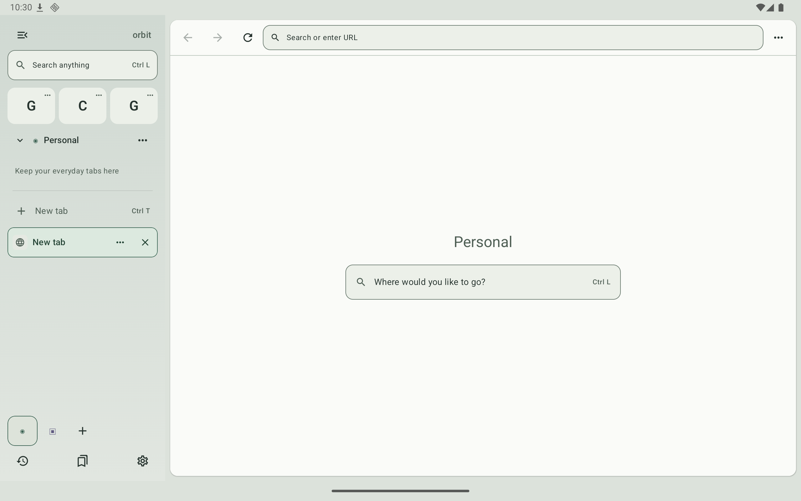
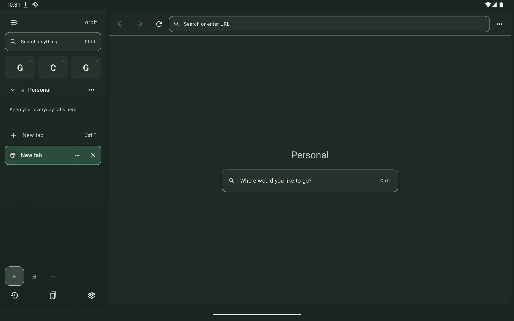
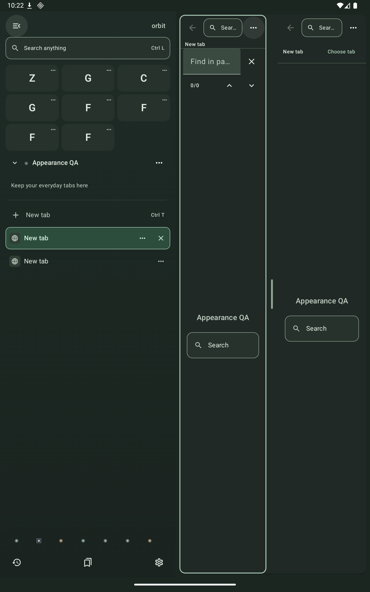

# Orbit

Androidタブレット向けのサイドバー中心のワークスペースブラウザ。Kotlin / Jetpack Compose / Material 3 / WebView / Room / DataStoreで構成しています。



## 主な機能

- Spaceごとのタブ管理、固定タブ、共通のFavorites、Bookmarks、履歴。
- URL・検索・タブ・Space・コマンドをまとめて探せるCommand Bar。
- 2ペインのSplit、幅変更・折りたたみ可能なSidebar、ドラッグによる並び替え。
- ライト／ダーク／システムテーマ。選択状態と文字のコントラストを調整。
- 日本語・中国語・韓国語のIME入力、キーボード操作、マウス／トラックパッドのスクロール。
- ページ内検索、Desktop Mode、通常のHTTPダウンロード、システムファイル選択。

バージョンは**0.1.0 / MVP**です。対応範囲と制限は下記に記載しています。

## 起動

Android Studioでこのディレクトリを開いてGradle Syncを実行し、`app`をAndroid 8.0以降のタブレットで起動してください。横画面を推奨します。端末の回転やAndroidのマルチウィンドウは制限していません。

- JDK 17
- Android SDK Platform 36（Build Tools等はGradle / Android Studioで取得）
- minSdk 26 / targetSdk 36
- Gradle Wrapper同梱

```sh
git clone https://github.com/TakeruF/android-tab-browser.git
cd android-tab-browser
./gradlew :app:assembleDebug
```

CLIでは`ANDROID_HOME`でAndroid SDKを指定するか、ローカルの`local.properties`に`sdk.dir`を設定してください。`local.properties`はGit管理対象外です。

ADB接続したタブレット／エミュレーターにインストール:

```sh
adb install -r app/build/outputs/apk/debug/app-debug.apk
adb shell am start -n com.orbit.browser/.MainActivity
```

複数端末を接続している場合は`adb -s <serial>`で対象を指定してください。

APK: `app/build/outputs/apk/debug/app-debug.apk`。Releaseは`./gradlew :app:assembleRelease`で生成できますが、現在は署名設定を含めていないためunsignedです。

## 操作

- サイドバー下部のアイコンからSpaceを切り替え。Spaceのメニューから名前・色・アイコンを編集。
- `Ctrl L`でURL・検索・タブ・Space・コマンドを検索。`>`でコマンドだけを表示。
- `g` / `ddg` / `yt` / `gh` / `scholar`などのキーワード検索。検索エンジンは設定から追加・編集・削除。
- タブ行を長押ししてドラッグ＆ドロップで並び替え。マウス、またはタブのアイコンからは直接ドラッグ。挿入線とプレビューを表示し、リスト端で自動スクロール。
- 区切り線の上下にドロップして固定・解除。最上部にドロップしてFavorites化、Favoritesを下に戻してタブ化。下部のSpaceアイコンへドロップして移動。タブの`…`から保存・右ペイン表示などの操作。
- ページの`…`からSplit、Desktop Mode、ページ内検索、保存操作。
- Splitの中央の仕切りをドラッグして比率変更。右ペインの`Choose tab`で表示タブを選択。ページメニューから左右入れ替え・Split解除。
- サイドバー境界を右にドラッグして幅変更・展開、大きく左にスワイプして折りたたみ。

| ショートカット | 操作 |
| --- | --- |
| Ctrl / Command + L | Omnibox |
| Ctrl / Command + T | 新規タブ |
| Ctrl / Command + W | 選択ペインのタブを閉じる |
| Ctrl / Command + Shift + T | 最後に閉じたタブを復元 |
| Ctrl / Command + Tab / Shift + Tab | 次 / 前のタブ |
| Ctrl / Command + R | リロード |
| Ctrl / Command + F | ページ内検索 |
| Alt + Left / Right | 戻る / 進む |

## 設計

[アーキテクチャとRoom schema](docs/ARCHITECTURE.md)を参照してください。WebViewの設定・API操作は`WebViewBrowserEngine`に閉じ込め、ComposeはAndroid用描画アダプターからViewを接続します。セッションプールは最大3つで、非表示タブを無制限に保持しません。

## 対応範囲と制限

Archiveは起動時と手動実行です。

- Spacesはタブのグループです。Favoritesは全Space共通です。Cookie・Web Storage・サイトログインは共有します。
- アプリ再起動時はRoomのURL・タイトル・順序・選択タブを復元します。WebViewのページ内履歴は同じActivityのLRU退避中に最大20タブ分を保持します。フォーム値・スクロール位置・プロセスをまたぐページ内履歴の復元は保証しません。
- Cookieは有効、サードパーティCookieは無効。証明書エラーはキャンセルし、サイト権限は毎回確認します。
- `target="_blank"`とユーザー操作によるURL付き`window.open`に対応。`about:blank`へJavaScriptで文書を書き込むポップアップは未対応です。
- ダウンロードはDownloadManagerを使用。blob / data URLは未対応です。Android 8–9ではアプリ専用Downloads、Android 10以降では公開Downloadsに保存します。
- アップロードはシステムのドキュメントピッカーを使用。直接撮影するカメラピッカーとフォルダーアップロードは未実装です。
- Sync / Reader / AI / Userscripts / Content Blocking / Private Browsingは未実装です。

検索テンプレートにはHTTPS URLと`{query}`を使用してください。`bd`は百度検索です。

新規インストールでは「Automatic search by region」が有効です。既存の保存済みデフォルトは維持し、設定から自動判定を有効にできます。有効なら、IPの国コードが`CN`のとき百度、その他はGoogleを選びます。起動をブロックせず、取得不能時は携帯網 → SIM → 端末の地域設定を使用します。言語だけでは中国大陸と判定しません。IP判定は24時間、代替判定・失敗は1時間キャッシュし、起動・画面復帰時に期限を確認します。設定の「Check again」から再判定できます。手動で検索エンジンを選ぶと自動設定がオフになります。削除したエンジンは再作成せず、必要なエンジンがなければ現在の設定を保持します。

IP判定には[api.country.is](https://github.com/lineofflight/country)へHTTPS接続します。相手には接続元IPが見えますが、検索語・閲覧履歴・端末IDは送信しません。VPN利用時は出口IPの国が判定される場合があります。中国大陸の実回線での到達性は未検証です。

Arcの参照仕様と今回の検証は[ARC_REFINEMENT.md](docs/ARC_REFINEMENT.md)を参照してください。

日本語・中国語・韓国語の変換操作はIME compositionを保持し、未確定中のEnter・矢印をCommand Barから奪わない設計です。端末テストにはdebugビルドだけに含まれるInputConnectionテスト用IMEを使います。通常利用時は端末のキーボードを選択してください。

## テストと画面確認

```sh
./gradlew :app:testDebugUnitTest :app:lintDebug
./gradlew :app:assembleDebug :app:assembleRelease :app:assembleDebugAndroidTest
ANDROID_SERIAL=emulator-5554 ./gradlew :app:connectedDebugAndroidTest
```

`emulator-5554`は対象端末のserialに置き換えてください。

2026-10-03、JDK 17 / SDK 36 / API 36のPixel Tabletエミュレーターで確認しました。

| 検証 | 結果 |
| --- | --- |
| ユニットテスト | 34件成功 |
| Android端末テスト | 29件成功（UI・CJK入力・WebView・スクロール・ドラッグ） |
| Debug / Release / Test APK | ビルド成功。Releaseはunsigned |
| Android Lint | エラー0、警告23 |

追加のUIテスト9件では、合成済み画面の文字・アイコンのコントラスト、全6色のSpace、テーマ切替・Activity再生成、Command Barのキーボード操作、折りたたみ時のタブの読み上げ情報、縦画面の狭いSplitとページ内検索、システムテーマ追従、接続エラーの再試行を確認しています。

[詳細な検証記録](docs/VALIDATION.md)には修正内容、各テストの範囲、レポートの場所を記載しています。物理端末、Android 8–15、メーカーごとのIME、実ハードウェアのカメラ・マイク・位置情報・トラックパッドは未確認です。

| ダークテーマ | 縦画面のSplit / ページ内検索 |
| --- | --- |
|  |  |

[Command Bar](docs/screenshots/ui-light-commands.png)・[ドラッグ中](docs/screenshots/arc-sidebar-drag.png)・[地域検索の設定](docs/screenshots/regional-search-settings.png)も実行時の画面です。

## ライセンス

Orbit本体は[MIT License](LICENSE)です。依存ライブラリの出典・ライセンスは[THIRD_PARTY_NOTICES.md](THIRD_PARTY_NOTICES.md)にまとめ、原文と著作権表記をAPKの`assets/licenses/`にも同梱しています。
