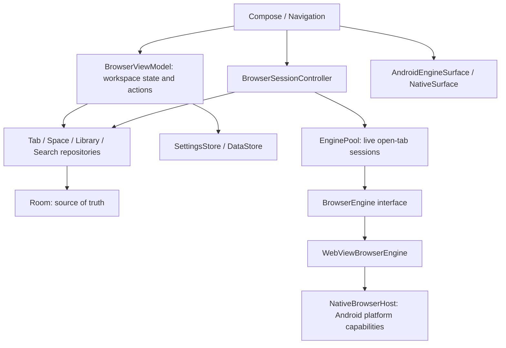

# Architecture

## Responsibility boundaries



`MainActivity`は起動Intent・Windowのキーボードイベント・ホスト作成だけを担当します。`BrowserViewModel`はActivity / View / WebViewを保持しません。URL判定と候補生成は純粋関数です。Composeが保持するタブID・Split比率と、エンジンが保持するページ状態は別の状態です。

## Directory structure

```text
app/src/main/java/com/takeruf/nagi/
├── MainActivity.kt / NagiApplication.kt
├── domain/model/          Space, BrowserTab, SearchEngine, HistoryEntry, Bookmark, Settings
├── data/
│   ├── room/              Entities, BrowserDao, NagiDatabase, mappings
│   ├── datastore/         SettingsStore
│   └── repository/        Workspace, Tab, Space, Library, SearchEngine repositories
├── browser/
│   ├── engine/            BrowserEngine, WebView implementation, Android rendering bridge, native host
│   ├── tabs/              EnginePool, BrowserSessionController
│   ├── search/            InputResolver, seeds, SuggestionProvider
│   └── downloads/         DownloadService, Content-Disposition filename policy
└── ui/
    ├── NagiApp.kt        navigation composition and activity-scoped sessions
    ├── browser/           ViewModel, panes, new-tab page, shortcuts, surface adapter
    ├── sidebar/           Spaces, favorites, pinned/ordinary/archived tabs, drag targets
    ├── commandbar/        IME-aware input and categorized candidates
    ├── splitview/         resizable two-pane layout
    ├── settings/          preferences and search-engine editor
    ├── library/           history / ordinary bookmarks
    ├── components/        icons / touch targets
    └── theme/             independent light / dark palette
```

The debug source set contains an IME used only by instrumentation tests. It is absent from the release variant.

## Room schema v1

| Table | Primary key | Fields / indexes |
| --- | --- | --- |
| spaces | id: String | name, icon, color, position, activeTabId |
| tabs | id: String | spaceId FK cascade, url, title, faviconUrl, isPinned, position, lastAccessedAt, closedAt, archivedAt; indexes on spaceId / closedAt / lastAccessedAt |
| search_engines | id: String | name, keyword unique index, urlTemplate, iconUrl |
| history | id: Long auto | url, title, faviconUrl, visitedAt; indexes on url / visitedAt |
| bookmarks | id: String | url, title, faviconUrl, nullable spaceId FK cascade, isFavorite, createdAt; indexes on spaceId / url |

`Space.activeTabId`は循環外部キーを避けるため論理参照です。タブ削除・移動・復元はRoom transactionで関連Spaceの選択も変更し、最後のタブを閉じたSpaceには新規タブを生成します。最後のSpaceと最後の検索エンジンは削除できません。Favoritesは`isFavorite=true`かつ`spaceId=null`で全Space共通、通常Bookmarkは`isFavorite=false`かつ`spaceId=null`です。旧Space付きFavoritesは起動時に共通へ移行します。Favoritesの表示順は既存の`createdAt`を順序値として更新します。

閉じたタブは最新30件を保持。履歴は最大5,000件を保存し、UI候補・履歴画面へ最新2,000件を配信します。faviconはアプリのキャッシュ内PNGを参照するため、キャッシュ削除後は次回閲覧時に再取得されます。

RoomのJSON schemaは`app/schemas/`へ出力しています。v2以降では明示的なMigrationとmigration testを追加し、破壊的migrationは使いません。

DataStoreはtheme、sidebarWidth、sidebarCollapsed、defaultSearchEngineId、selectedSpaceId、restoreTabs、desktopDefault、openLinksInNewTab、archivePeriodを保存します。変更は原子的な`edit`内で現在値を読んで適用します。

## Navigation

`browser`をrootに、`settings` / `history` / `bookmarks`へ移動します。サイドバーは共通で、セッションコントローラーはNavHostの外側に保持します。Command Bar・Space編集・Search Engine編集はDialogです。画面移動でWebViewを全破棄しません。

## Engine lifecycle

1. Compose paneはTab IDでセッションを取得。
2. EnginePoolは一度開いたタブのliveセッションを、タブ数や非表示時間によって自動破棄せず保持。
3. Splitの2つの表示IDを指定し、非表示セッションは`onPause`、表示時は`onResume`。画面離脱とActivityの停止でもpause。
4. 再表示時は同じengineとページを再利用し、URLの再読み込みやsnapshot復元を行わない。Space切り替えでも保持。
5. 閉じた／Archive／削除されたタブのセッションはnative surfaceを親から外してdestroy。Activity終了時は全セッションをdestroy。

WebViewの`pauseTimers()`はプロセス全体へ作用するので呼びません。`onPause()`は全JavaScriptタイマーの停止を保証しません。開いたページ数に応じてメモリ使用量は増えます。Activity終了やOSによるプロセス終了後はRoomのURLから読み込み直します。

## Chromium migration seam

`BrowserEngine`のAPIと`PageState` / `EngineEvent`を実装し、Android描画用の`AndroidEngineSurface`を提供します。Factoryを差し替えるとRepository・URL判定・Space・Command Barは維持できます。snapshotはmarker interfaceでエンジン内だけが解釈します。Androidのpermission / upload / download / fullscreenはホストとの契約で呼び出します。

エンジン間の履歴snapshot互換性やCookie移行は含めません。Chromium自体のビルド・sandbox・アップデート配布・ABI対応は別途必要です。

## Implementation phases

1. Gradle / domain / schema / settings / URL and keyword resolution. Compile.
2. Repository invariants / closed-tab and launch restoration. Compile.
3. BrowserEngine / bounded pool / native capability host. Compile.
4. Sidebar / browsing panes / editable engines / history and bookmarks / navigation. Assemble.
5. Split / command suggestions / shortcuts / drag and archive-on-launch. Assemble and integration tests.
6. CJK composition regression tests / lint / tablet rendering / release compile.

## IME input policy

Command Bar uses `TextFieldState`, retaining text, selection and composition together in the synchronous editing buffer. The IME receives key events before application dispatch. If Enter / arrows / Escape still reach the application during composition, the command bar consumes them without navigation or focus movement. IME Go also checks composition. A committed query is resolved from the current buffer, never stale suggestions. Engine keywords are lowercased when saved, never during editing. The UI input is not fed asynchronously through the ViewModel.

References: [TextFieldValue and composition](https://developer.android.com/reference/kotlin/androidx/compose/ui/text/input/TextFieldValue), [Compose input](https://developer.android.com/develop/ui/compose/text/user-input), [WebChromeClient](https://developer.android.com/reference/android/webkit/WebChromeClient), [AGP 8.13](https://developer.android.com/build/releases/agp-8-13-0-release-notes).


## Sidebar drag and regional search

`SidebarDragState` registers visible row / section / Space rectangles in root coordinates. The stable sidebar owns the pointer gesture, so `LazyColumn` recycling the source row during edge scrolling does not cancel the drag. Touch holds a row; the favicon and mouse use touch-slop-based immediate dragging. Cancel only clears the preview. A drop uses an explicit insertion side, removes the source before calculating its new index, and updates pin status and positions in one Room transaction. Favorite conversion and removal are transactional; Favorites remain a shared shortcut model and do not preserve an active WebView session.

`RegionalSearchDefaults` runs outside workspace initialization, on launch and foreground transitions. An injectable IP lookup and fallback provider make the country policy testable without external requests. A mutex serializes checks; the DataStore atomic edit rechecks the automatic-mode flag so manual choices made during a request win. Region/source/timestamp and the one-time Baidu seed marker are DataStore preferences. Room schema v1 remains unchanged. An existing saved default from older versions is treated as manual because the old schema had no manual-choice flag. Fresh installs default to automatic mode; existing users can enable it in Settings.
