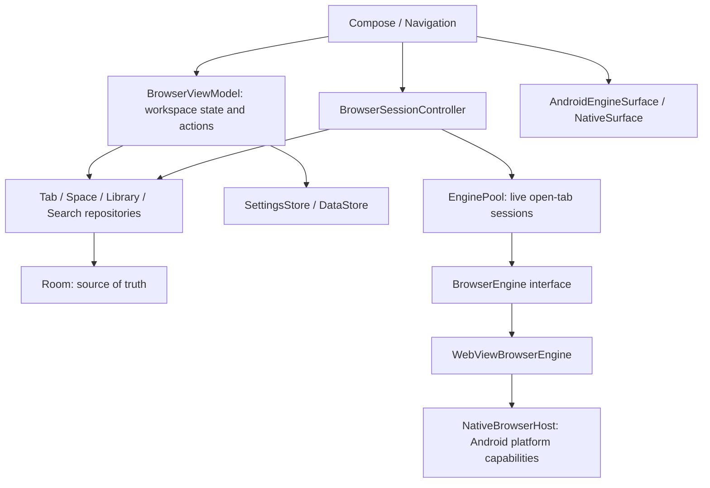

# Architecture

## Responsibility boundaries



`MainActivity` handles launch intents, window keyboard events, and host creation. `BrowserViewModel` holds no Activity/View/WebView references. URL resolution and suggestion generation are pure functions. Compose-owned tab IDs and Split ratios are separate from engine-owned page state.

## Directory structure

```text
app/src/main/java/com/takeruf/nagi/
├── MainActivity.kt / NagiApplication.kt
├── domain/model/          Space, BrowserTab, SearchEngine, HistoryEntry, Bookmark, Settings
├── data/
│   ├── room/              Entities, BrowserDao, NagiDatabase, mappings
│   ├── datastore/         SettingsStore
│   └── repository/        Workspace, Tab, Space, Library, SearchEngine repositories
├── browser/
│   ├── engine/            BrowserEngine, WebView implementation, Android rendering bridge, native host
│   ├── tabs/              EnginePool, BrowserSessionController
│   ├── search/            InputResolver, seeds, SuggestionProvider
│   └── downloads/         DownloadService, Content-Disposition filename policy
├── updates/               release manifest, APK verification, installer, update UI
└── ui/
    ├── NagiApp.kt        navigation composition and activity-scoped sessions
    ├── browser/           ViewModel, panes, new-tab page, shortcuts, surface adapter
    ├── sidebar/           Spaces, favorites, pinned/ordinary/archived tabs, drag targets
    ├── commandbar/        IME-aware input and categorized candidates
    ├── splitview/         resizable two-pane layout
    ├── settings/          preferences and search-engine editor
    ├── library/           history / ordinary bookmarks
    ├── components/        icons / touch targets
    └── theme/             independent light / dark palette
```

The debug source set contains an IME used only by instrumentation tests. It is absent from the release variant.

## Room schema v2

| Table | Primary key | Fields / indexes |
| --- | --- | --- |
| spaces | id: String | name, icon, color, position, activeTabId |
| tabs | id: String | spaceId FK cascade, url, title, faviconUrl, isPinned, position, lastAccessedAt, closedAt, archivedAt, parentTabId; indexes on spaceId / closedAt / lastAccessedAt |
| search_engines | id: String | name, keyword unique index, urlTemplate, iconUrl |
| history | id: Long auto | url, title, faviconUrl, visitedAt; indexes on url / visitedAt |
| bookmarks | id: String | url, title, faviconUrl, nullable spaceId FK cascade, isFavorite, createdAt; indexes on spaceId / url |

`Space.activeTabId` is a logical reference to avoid a cyclic foreign key. Tab deletion, movement, and restoration update the affected Space selection in Room transactions; closing its final tab creates a new tab. The final Space and search engine cannot be deleted. Shared Favorites use `isFavorite=true` and `spaceId=null`; ordinary Bookmarks use `isFavorite=false` and `spaceId=null`. Legacy Space-scoped Favorites are migrated to shared entries on startup. Favorite ordering updates the existing `createdAt` field as an order value.

The 30 most recently closed tabs are retained. History stores up to 5,000 records, exposing the latest 2,000 to suggestions and the history screen. Favicons refer to PNG files in app cache and are fetched again on the next visit after cache removal.

Room JSON schemas are exported to `app/schemas/`. Schema v2 adds nullable `parentTabId` through a tested, non-destructive auto-migration from v1. Future schema changes require explicit migration coverage; destructive migration is not used.

DataStore persists theme, sidebarWidth, sidebarCollapsed, defaultSearchEngineId, selectedSpaceId, restoreTabs, desktopDefault, openLinksInNewTab, and archivePeriod, along with theme-color and search preferences. Changes read and apply the current value inside atomic `edit` operations.

## Navigation

Navigation starts at `browser` and includes `settings`, `history`, and `bookmarks`. The sidebar is shared; the session controller is retained outside NavHost. Command Bar, Space editing, and search-engine editing use dialogs. Navigation does not destroy every WebView.

## Engine lifecycle

1. A Compose pane retrieves a session by tab ID.
2. EnginePool retains opened live sessions without automatic eviction based on tab count or time hidden.
3. Both visible Split IDs are provided. Hidden sessions receive `onPause`, visible sessions `onResume`; leaving the browser screen or stopping the Activity also pauses sessions.
4. Returning to a tab or Space reuses its engine/page without reloading the URL or restoring a snapshot.
5. Closing, archiving, or deleting a tab detaches and destroys its native surface/session. Ending the Activity destroys all sessions.

WebView `pauseTimers()` affects the entire process and is not called. `onPause()` does not guarantee that every JavaScript timer stops. Memory use grows with opened pages. After Activity/process termination, pages reload from their Room URLs.

## Chromium migration seam

Implement the `BrowserEngine` API, `PageState`/`EngineEvent`, and `AndroidEngineSurface` for Android rendering. Replacing the factory preserves repositories, URL resolution, Spaces, and the Command Bar. Snapshots use a marker interface interpreted only within the engine. Android permission/upload/download/fullscreen operations use host contracts.

Cross-engine history-snapshot compatibility and cookie migration are outside this seam. Building Chromium, sandboxing, update distribution, and ABI support require separate work.

## Implementation phases

1. Gradle / domain / schema / settings / URL and keyword resolution. Compile.
2. Repository invariants / closed-tab and launch restoration. Compile.
3. BrowserEngine / live-session pool / native capability host. Compile.
4. Sidebar / browsing panes / editable engines / history and bookmarks / navigation. Assemble.
5. Split / command suggestions / shortcuts / drag and archive-on-launch. Assemble and integration tests.
6. CJK composition regression tests / lint / tablet rendering / release compile.

## IME input policy

Command Bar uses `TextFieldState`, retaining text, selection and composition together in the synchronous editing buffer. The IME receives key events before application dispatch. If Enter / arrows / Escape still reach the application during composition, the command bar consumes them without navigation or focus movement. IME Go also checks composition. A committed query is resolved from the current buffer, never stale suggestions. Engine keywords are lowercased when saved, never during editing. The UI input is not fed asynchronously through the ViewModel.

References: [TextFieldValue and composition](https://developer.android.com/reference/kotlin/androidx/compose/ui/text/input/TextFieldValue), [Compose input](https://developer.android.com/develop/ui/compose/text/user-input), [WebChromeClient](https://developer.android.com/reference/android/webkit/WebChromeClient), [AGP 8.13](https://developer.android.com/build/releases/agp-8-13-0-release-notes).


## Sidebar drag and regional search

`SidebarDragState` registers visible row / section / Space rectangles in root coordinates. The stable sidebar owns the pointer gesture, so `LazyColumn` recycling the source row during edge scrolling does not cancel the drag. Touch holds a row; the favicon and mouse use touch-slop-based immediate dragging. Cancel only clears the preview. A drop uses an explicit insertion side, removes the source before calculating its new index, and updates pin status and positions in one Room transaction. Favorite conversion and removal are transactional; Favorites remain a shared shortcut model and do not preserve an active WebView session.

`RegionalSearchDefaults` runs outside workspace initialization, on launch and foreground transitions. An injectable IP lookup and fallback provider make the country policy testable without external requests. A mutex serializes checks; the DataStore atomic edit rechecks the automatic-mode flag so manual choices made during a request win. Region/source/timestamp and the one-time Baidu seed marker are DataStore preferences. The regional-search implementation did not change Room schema v1; current schema v2 is described above. An existing saved default from older versions is treated as manual because the old schema had no manual-choice flag. Fresh installs default to automatic mode; existing users can enable it in Settings.
